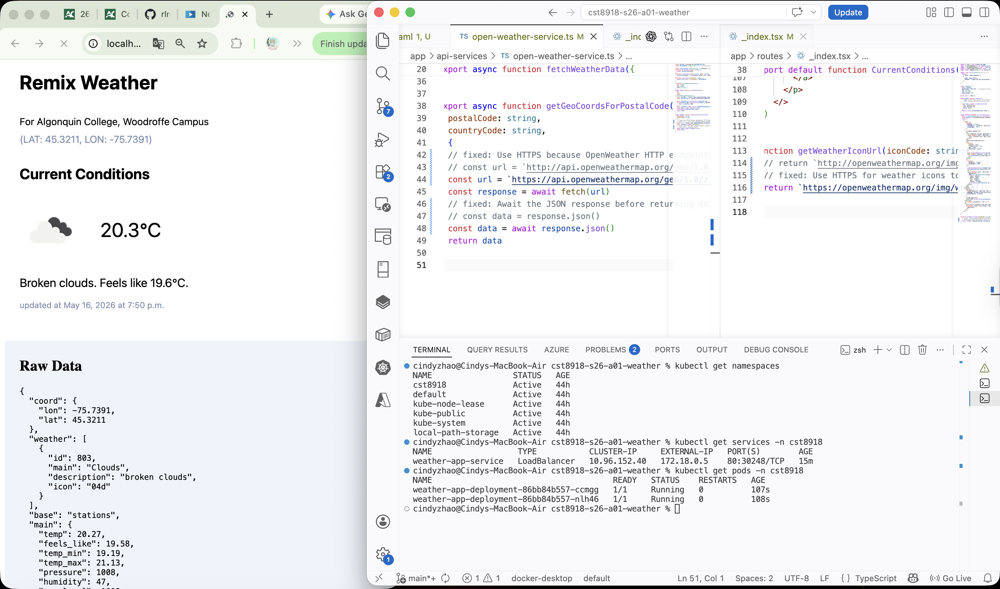
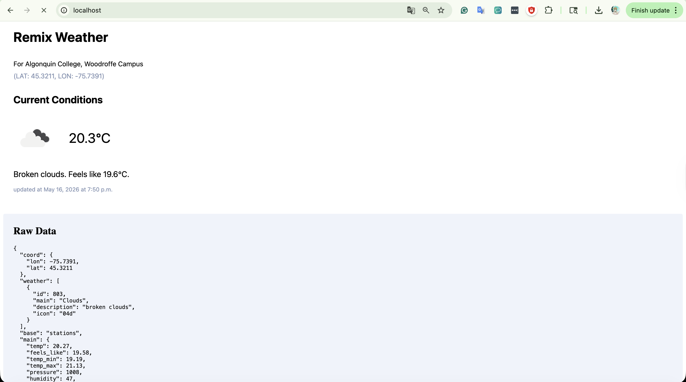
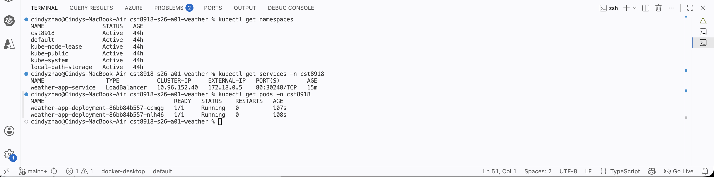
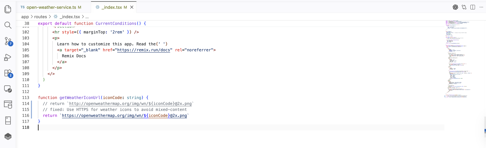
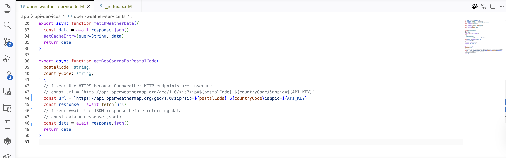

# CST8918 Lab A01 - Weather App Kubernetes Deployment

## Overview
This repository contains the Kubernetes configuration files for deploying the Remix Weather App in Docker Desktop Kubernetes.

## Kubernetes Files /k8s
- `a01_namespace.yaml`
- `a01_deployment.yaml`
- `a01_service.yaml`

## Demo

The screenshot submission includes:

* Browser running the weather application
* kubectl get namespaces
* kubectl get services -n cst8918
* kubectl get pods -n cst8918





## Bug Fix

### 1. Updated OpenWeather API URLs from HTTP to HTTPS

#### Issue

Some OpenWeather API endpoints and weather icon URLs were using `http://` instead of `https://`.



#### How to identify the issue
The issue was identified by searching the project source code for OpenWeather API references using:
```bash
grep -R "openweathermap\|api.openweather\|weather?" app . --exclude-dir=node_modules
```
This revealed several outdated HTTP URLs in the application.

#### Why it was changed

The URLs were updated to HTTPS because:

* HTTPS is the modern secure web standard
* Browsers may block mixed-content HTTP resources
* OpenWeather recommends secure HTTPS endpoints
* HTTPS improves application security and reliability

### 2. Added missing await for JSON response

#### Issue 
response.json() returns a Promise. Without await, the function may return unresolved asynchronous data instead of parsed JSON content.



#### How to identify the issue
The issue was found during code review. Since `response.json()` returns a Promise, the missing `await` keyword indicates that the API response data was not being fully resolved before use.
